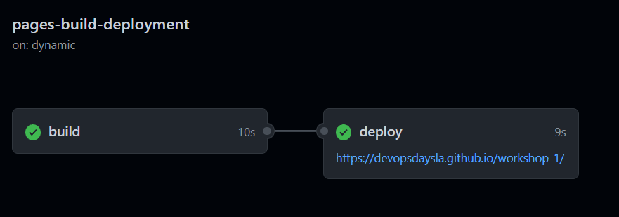
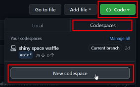
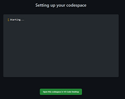
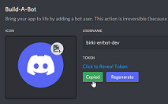

---
# try also 'default' to start simple
theme: geist
# random image from a curated Unsplash collection by Anthony
# like them? see https://unsplash.com/collections/94734566/slidev
background: https://source.unsplash.com/collection/94734566/1920x1080
# apply any windi css classes to the current slide
class: 'text-center'
# https://sli.dev/custom/highlighters.html
highlighter: shiki
# show line numbers in code blocks
lineNumbers: false
# some information about the slides, markdown enabled
info: |
  ## Intro to DevOps with Errbot
  An introduction to the world of DevOps

# persist drawings in exports and build
drawings:
  persist: false
---

# Intro to DevOps with <span>Errbot</span>

<div class="pt-12">
  <span @click="$slidev.nav.next" class="px-2 py-1 rounded cursor-pointer" hover="bg-white bg-opacity-10">
    Press Space to begin the journey <carbon:arrow-right class="inline"/>
  </span>
</div>

<div class="abs-br m-6 flex gap-2">
  <button @click="$slidev.nav.openInEditor()" title="Open in Editor" class="text-xl icon-btn opacity-50 !border-none !hover:text-white">
    <carbon:edit />
  </button>
  <a href="https://github.com/slidevjs/slidev" target="_blank" alt="GitHub"
    class="text-xl icon-btn opacity-50 !border-none !hover:text-white">
    <carbon-logo-github />
  </a>
</div>

<style>
span {
  background-color: #2B90B6;
  background-image: linear-gradient(45deg, #4EC5D4 10%, #146b8c 20%);
  background-size: 100%;
  -webkit-background-clip: text;
  -moz-background-clip: text;
  -webkit-text-fill-color: transparent;
  -moz-text-fill-color: transparent;
}
</style>

<!--
The last comment block of each slide will be treated as slide notes. It will be visible and editable in Presenter Mode along with the slide. [Read more in the docs](https://sli.dev/guide/syntax.html#notes)
-->

---

# What is DevOps?

DevOps is a set of combined practices that merge development (Dev) and operations (Ops) together

- 💡 Continuous planning
- ⚡ Rapid application development
- 👯 Sharable development environments
- 🤖 Automated and repeatable builds & tests
- 🚀 CI/CD pipelines
- 🔭 Obervability
- 🔒 Security

<br>
<br>

Read more about [what is DevOps](https://en.wikipedia.org/wiki/DevOps)

<!--
You can have `style` tag in markdown to override the style for the current page.
Learn more: https://sli.dev/guide/syntax#embedded-styles
-->

<style>
h1 {
  background-color: #2B90B6;
  background-image: linear-gradient(45deg, #4EC5D4 10%, #146b8c 20%);
  background-size: 100%;
  -webkit-background-clip: text;
  -moz-background-clip: text;
  -webkit-text-fill-color: transparent;
  -moz-text-fill-color: transparent;
}
</style>

---

# DevOps Visualized


---

# Plan 💡

The planning phase of DevOps is often [agile software development](https://en.wikipedia.org/wiki/Agile_software_development)

- • Iterative
- • Continuous
- • Can (and will) change frequently
- • No "big bang" launch, an iterative approach

> For this demo we will be planning the launch of a new chat bot command `.devops`

<style>
blockquote {
  color: #A9A9A9;
}
</style>

---

# Code 💻

The coding phase of DevOps is where ideas come to life... and where nightmares are born

```python
if production == "down":
  print("This does not bring joy")
```

- 👯 Develop in sharable and automated environments
- 🖌️ Adopt a common code style (use a linter)
- ⚙️ Use a version control system
- 💾 Commit and push often
- 👀 Work in the open, get feedback, request reviews

> For the DevOpsDaysLA demo, we will be writting code in [GitHub codespaces](https://github.com/features/codespaces)

<style>
blockquote {
  color: #A9A9A9;
}
</style>

---

# Build 📦

The build phase of DevOps is where the code is compiled and often saved as an artifact for later deployment

- 🛠️ Build your application / binaries in a repeatable environment (CI/CD)
- 🐳 Containerize applications and services where you can
- 🔒 Secure your software supply chain when building applications
- 🔑 Seperate packages, containers, and binaries from configurations and secrets

> For the DevOpsDaysLA demo, we will be using Docker to containerize and build our application

<style>
blockquote {
  color: #A9A9A9;
}
</style>

---

# Test 🧪

The test phase of DevOps is where the application is... tested!

- 👯 Repeatable test environment (CI/CD + Docker)
- 👨‍🔬 Unit tests
- 🌐 Integration tests
- 🔬 Container scanning
- 🔎 SAST & DAST - Code scanning

> For the DevOpsDaysLA demo, you will get exposure to unit tests, container scanning, and static analysis

<style>
blockquote {
  color: #A9A9A9;
}
</style>

---

# Release 🏷️

TODO

---

# Deploy 🚀

TODO

---

# Operate 🧰

TODO

---

# Monitor 🔎

TODO

---

# What is Errbot? 🤖

[Errbot](https://github.com/GrantBirki/errbot) is an implementation of the [errbotio/errbot](https://github.com/errbotio/errbot) framework.

My version of errbot differs from the original in the following ways:

- • Containerized
- • Comes with pre-built features and chat commands
- • Custom helper functions
- • Altered base plugins and code
- • Custom configuration

> My version of errbot is specifically built around Discord, but many features natively support Slack as well. Check out the upstream source for [errbotio/errbot](https://github.com/errbotio/errbot) to learn more about supported backends, configuration, and bot development

<style>
blockquote {
  color: #A9A9A9;
}
</style>

---

# What can Errbot do?

Errbot can do **literally** anything you can write Python code to do!

> [Errbot Video Demo](https://giant.gfycat.com/UnripeReasonableErmine.mp4)

<style>
blockquote {
  color: #A9A9A9;
}
</style>

---

# Errbot for Fun

- • Get the [DownDetector](https://downdetector.com/) status of a service
- • Complement or Insult your friends
- • Remember a string of text for later
- • Get a random fact
- • Get the weather
- • Find the value of an item in a game
- • Join a Discord channel and play some music
- • Get the price of a stonk or crypto currency
- • Read a message over text to speech

---

# Errbot for Work

- • Get the status of a deployed service
- • DNS lookups
- • Update a firewall rule
- • Start a Kubernetes deployment
- • Trigger a deployment
- • Merge a pull request
- • Create a GitHub issue
- • Add a comment to a servicenow ticket
- • Create a Jira issue
- • Page an on-call engineer
- • Post your daily standup status
- • Get a post service metrics to a channel

---

# Hands-on Workshop Time 👐

In this workshop, we will be doing the following:

- 📚 Build our documentation page - [GitHub Pages](https://pages.github.com/)
- 💻 Implement our new `.devops` chatbot command
- 📦 Building the bot using [skaffold](https://skaffold.dev/) with our new command (Thanks [@murriel](https://github.com/murriel)!)
- 🧪 Ensure our test suite is passing
- 🔒 Run SAST on our code and container scanning on our container image
- 🤹 Interact and use our new chat command
- 🔭 Observe our bot's usage with Grafana & Loki
- 🚀 Run a real world CI/CD pipeline and deployment

---

# Getting Started 💡

- 1: Go to [github.com/DevOpsDaysLA/workshop-1](https://github.com/DevOpsDaysLA/workshop-1) and click "Fork" in the upper right corner
- 2: Ensure you fork the repo into the [DevOpsDaysLA](https://github.com/DevOpsDaysLA) organization. Note: If you are not part of the DevOpsDaysLA workshop, you can fork the repo to your personal GitHub account instead
- 3: Upon the successful fork, you will notice a GitHub action workflow has started for your documentation page
- 4: Go to your repo settings and ensure your GitHub pages site is accessible to view your documentation


---

# GitHub Pages 📄

[GitHub Pages](https://pages.github.com/) is a free service for hosting static website content on GitHub.com

Commits / Pushes to the `main` branch automatically update our documentation site

```yaml
name: pages
on:
  push:
    branches:
      - main
jobs:
  deploy:
    runs-on: ubuntu-latest
    steps:
      - uses: actions/checkout@ec3a7ce113134d7a93b817d10a8272cb61118579 # pin@v2
      - uses: actions/setup-python@f38219332975fe8f9c04cca981d674bf22aea1d3 # pin@v2
        with:
          python-version: 3.x
      - run: pip install mkdocs-material
      - run: mkdocs gh-deploy --force
```

---

# Pages GitHub Actions Workflow ⏩



Hooray! We not have all the nitty gritty documentation for our bot publically hosted on GitHub Pages!

---

# Setup

To begin implementing our `.devops` bot command, we need to first start our dev environment:

**DevOpsDaysLA Workshop:**

Simply create a new GitHub Codespace



**Non-DevOpsDaysLA Workshop:**

[Public setup documentation](https://errbot.birki.io/)

---

# Codespaces 💻

If you are apart of the DevOpsDaysLA workshop, you will be able to create a new GitHub Codespace for development

**What is GitHub Codespaces?**

- ☁️ Cloud hosted development environment
- 👯 Consistent, repeatable, and shareable
- 🚧 Removes the "it works on my machine" barrier
- 🔥 Saves us from dependency hell
- ⭐ Allows developers to deploy a dev environement in one-click and begin working on a project

You can read more about GitHub Codespaces [here](https://github.com/features/codespaces)

> Note: If you are not apart of the DevOpsDaysLA workshop, you will **not** have free access to GitHub codespaces and will need to setup errbot [locally for development](https://errbot.birki.io/setup/)

<style>
blockquote {
  color: #A9A9A9;
}
</style>

---

# Connect to Codespace



You will now connect to Codespaces through your browser. If you have [Visual Studio Code](https://code.visualstudio.com/) installed, you can optionally attach there as well.

Our Codespace environment comes pre-installed with all the dependencies we need to run errbot locally and develop new features.

> Note: If you are **not** apart of the DevOpsDaysLA workshop, you will be doing all the following steps from here on locally and not in GitHub Codespaces

<style>
blockquote {
  color: #A9A9A9;
}
</style>

---

# Generating a Bot Token 🔑

The first step to build our bot locally is to generate a bot token. This workshop uses Discord but you can also use Slack or [other chat services](https://errbot.readthedocs.io/en/latest/user_guide/setup.html#id1) as well.

**Discord:**

- 1: Navigate to the [Discord App Dashboard](https://discord.com/developers/applications)
- 2: Click the "New Application" button - Name your bot `firstname-errbot-dev`
- 3: Click the "Bot" tab -> "Add Bot"
- 4: Copy down your bot token



---

# Learn More

[Documentations](https://sli.dev) · [GitHub](https://github.com/slidevjs/slidev) · [Showcases](https://sli.dev/showcases.html)
