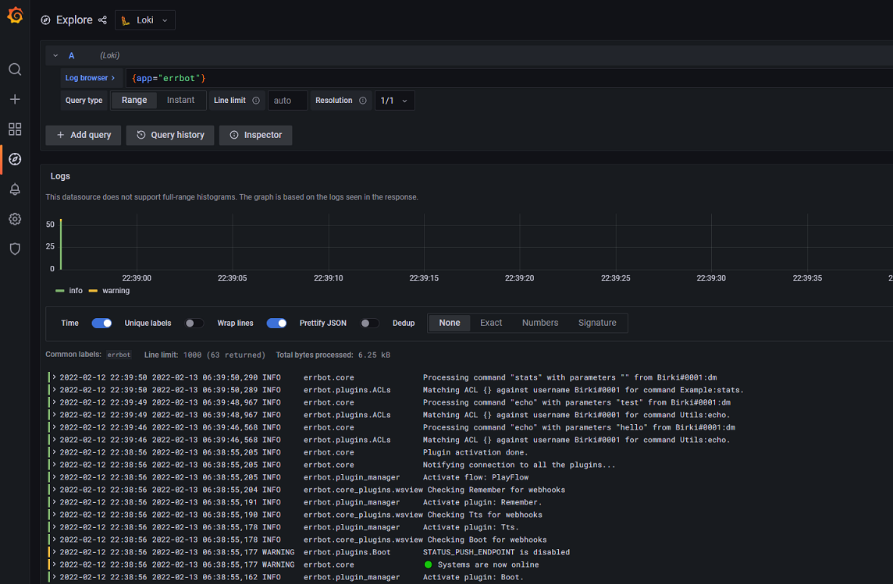
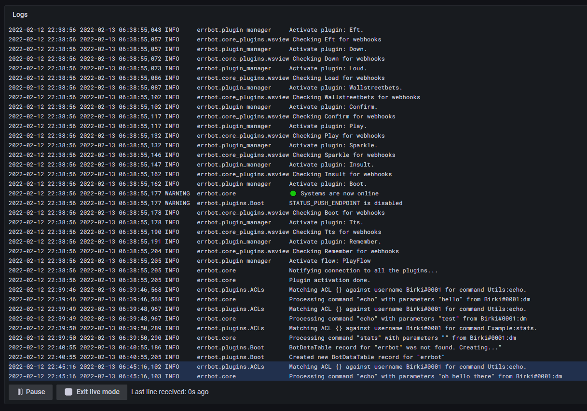

# Observability

This section will describe the observability components that this project uses out of the bot to track things like command usage, central logging, and more.

## Tech Stack

The tech stack used for log collection is as follows:

- [Promtail](https://grafana.com/docs/loki/latest/clients/promtail/)
- [Loki](https://github.com/grafana/loki)
- [Grafana](https://grafana.com/)

If you are unfamiliar with how a Grafana stack works I would highly suggest reading up about it because it can be a very powerful tool and all the components used are open-source.

A very short description of how this project uses the stack (listed above) is as follows:

1. Promtail scrapes the logs from the bot and pushes them to a Loki instance
2. Loki aggregates the log streams and tags them
3. Grafana uses Loki as a data source to graph, visualize, and query the logs that the bot generates

## Using the Log Stack

Since this bot can be built and tested in a variety of ways, the logging tech stack also can be setup in a variety of ways.

Here is a description of how the logging tech stack can be setup in the different environments:

- `make local`: Uses no logging stack at all
- `make run`: Starts the bot using docker-compose. Builds the full stack as seperate containers running on the same docker network (see docker-compose section below as the stack components need to be enabled first)
- `make kube`: Starts the bot in minikube with no logging stack initially. After the minikube cluster has been started, you have two options for starting your logging stack:
      - `script/k8s/obervability/setup`: Starts the logging stack inside of your minikube cluster (`make kube` must be run first)
      - Manually apply the `script/k8s/obervability/*.yaml.*` files to your minikube cluster and make sure to edit them as needed (specifcally the config map file to point to your Loki instance). This option is more complex and allows you to point your minikube cluster to a different Loki instance such as Grafana cloud. In production, the bot ships logs to Grafana cloud (`make kube` must be run first)

### docker-compose

Since the observability stack isn't really useful for average local development it is disabled by default.

To enable the logging stack with docker-compose and have it start up with your bot container when using `make run`, simply go into the `docker-compose.yml` file and uncomment the `obervability` section, and the volume section for the main errbot container. You will see in-line comments instructing you which lines to enable. Once you are done, run `make run` and your whole logging stack will start!

Once the docker-compose stack starts, you can navigate to [localhost:3000/login](http://localhost:3000/login) to get to your Grafana dashboard

- Username: `admin`
- Password: `admin`

The Loki data source is automatically configured so you can go straight to browsing your bot's logs!

### minikube

The observability stack is also disabled by default in minikube but it can be easily enabled with a single command:

```console
$ script/k8s/observability/setup
```

This will apply all the necessary k8s manifests to your minikube cluster to enable the observability stack.

Next, run the command below in a separate terminal window:

```console
$ kubectl port-forward --namespace observability service/loki-grafana 3000:80
```

Now you can navigate to [localhost:3000/login](http://localhost:3000/login) to get to your Grafana dashboard

- Username: `admin`
- Password: `<displayed to you in the 'script/k8s/observability/setup' script's output>`

> Note: If you need to get your Grafana password again, you can run `kubectl get secret --namespace observability loki-grafana -o jsonpath="{.data.admin-password}" | base64 --decode ; echo`

## Grafana Screenshots 📸




